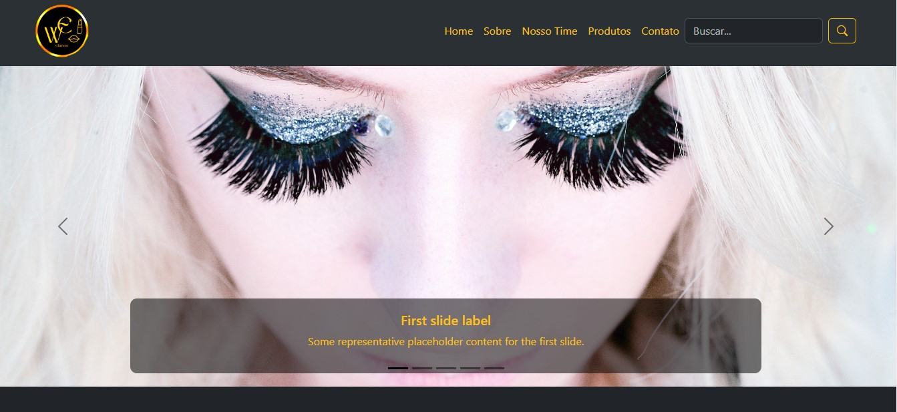
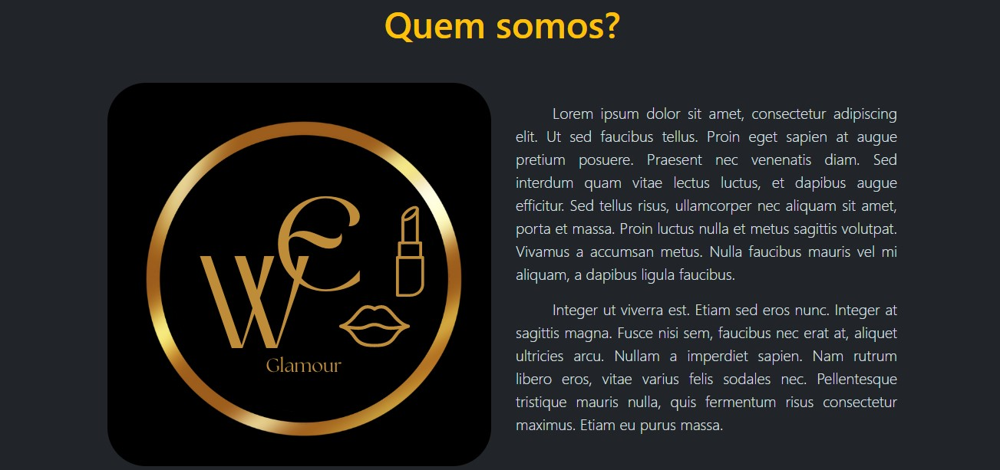
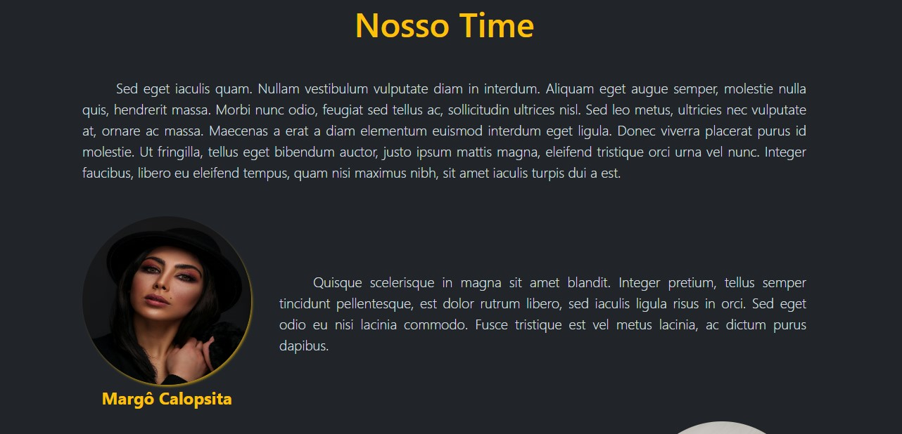
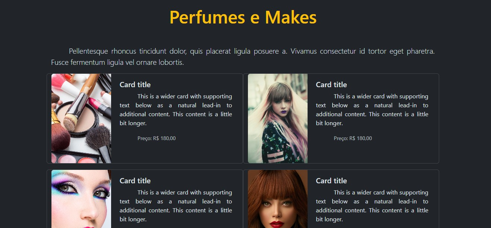

# Projeto de Loja

Projeto desenvolvido para fins didáticos durante o curso do Descomplica em parceria com o Instituto Nu.

## Desafio

* Criar uma vitrine de uma loja virtual
* Aplicação do uso do bootstrap, cards, carousel e imagens em um documento HTML
* O site deve ser composto por 6 seções: A barra de navegação, um carousel, quem somos, nosso time, nossos produtos e um rodapé. 

## WE Glamour - Loja de Cosméticos

Uma landing page para encontrar os melhores produtos que realçam a beleza natural, valorizando todos os tipos de pele, cabelo e estilos, por quem entende de diversidade. De forma fictícia, a empresa foi fundada por um grupo diverso, então a página de produtos de beleza reflete o compromisso com a inclusão.

Para conferir como ficou o meu projeto, <a href="https://mirraelly.github.io/descomplica-nu-loja" target="_blank"> clique aqui</a>.

## Desenvolvimento

### Tecnologias utilizadas

 
  
  
  

 

#### Início

Apresentação da página inicial, com boas-vindas, logo, menu de navegação e carrossel de imagens.

#### Quem somos

Apresentação do intuito da página.

#### Nosso time

Apresentação dos fundadores da marca.

#### Perfumes e Makes

Vitrines de produtos disponíveis.

#### Localização e Contato

Endereço de localização e meios de contatos, com opções de busca no mapa e inscrição na página.

